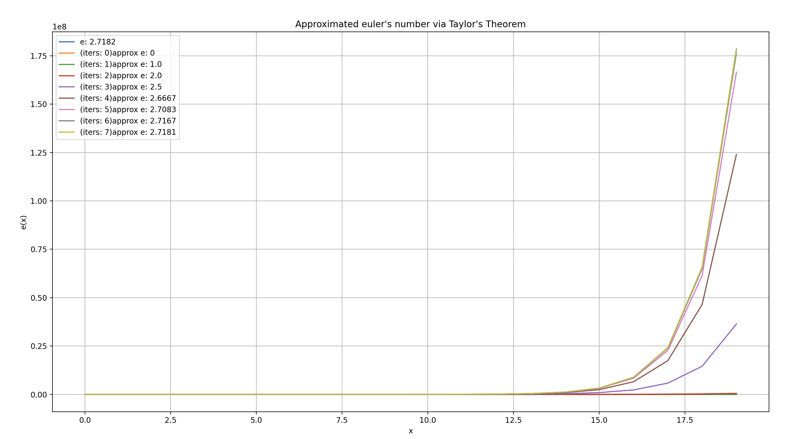
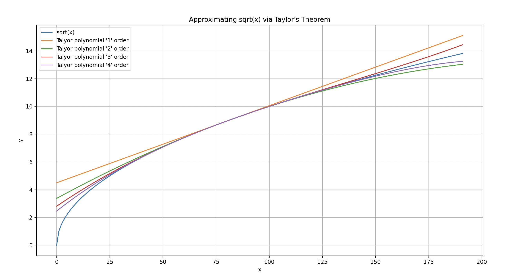

# Taylor Series: Approximating Any Function via a Polynomial

Application of taylor's theorem. Approximating f(x) = e^x and f(x) = sqrt(x). The former is approximated via the Maclaurin series, a special case of the Taylor Series. 

### 1) f(x) = e^x

### 2) f(x) = sqrt(x)

Truly impressive how far one can get with the application of derivatives (approximating any function with Taylor's Theorem and minimizing/maximizing any concave function)

Improvements to do: 
      1. Compute the avg. residual