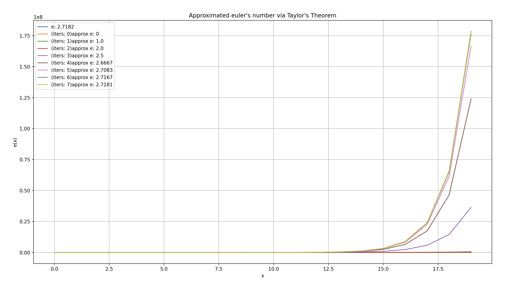

# Taylor Series: Approximating Any Function via a Polynomial

Application of taylor's theorem. Approximating f(x) = e^x, via the Maclaurin series, a special case of the Taylor Series.

Formula used: e^x = \sum_{i=0}^{\infty} \frac{x^i}{i!}

