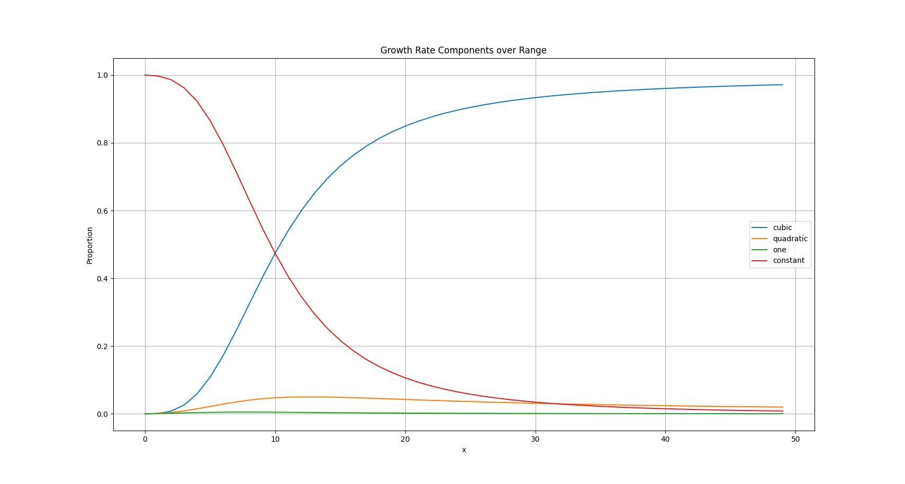

# Asymptotic Growth: The Dominance of the Largest Term
Asymptotical growth of functions suggest only the largest terms is relevant to
approximately determine its growth. Let's find out how much each term of a fixed function
contribute to the final output

